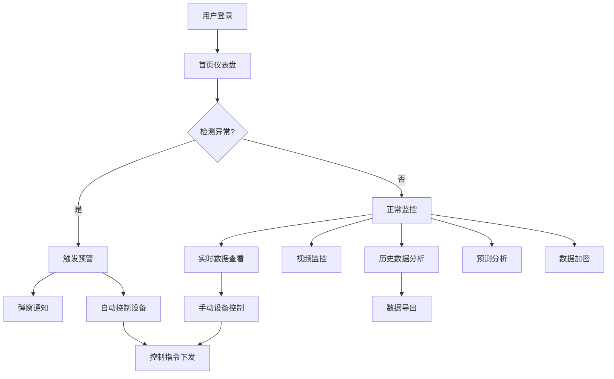

## 1. 产品概述

海洋智能牧场监测预测系统是一套面向海洋牧场运营管理者的全链路数字化平台，集水质实时监测、视频智能监控、设备远程控制、历史数据分析、趋势预测预警和数据安全加密于一体，旨在通过物联网+AI技术实现牧场养殖环境的精准感知与智能决策，降低人工巡检成本，提升养殖效益与风险防控能力。

- 目标用户：海洋牧场运营管理者、水产养殖技术人员、设备运维人员
- 核心价值：实时感知→智能预警→自动控制→数据驱动的闭环管理

## 2. 核心功能

### 2.1 用户角色

| 角色 | 注册方式 | 核心权限 |
|------|----------|----------|
| 管理员 | 系统分配 | 全部功能，用户管理，系统配置 |
| 操作员 | 管理员创建 | 设备监控、数据查看、设备控制 |
| 访客 | 管理员创建 | 仅数据查看，无控制权限 |

### 2.2 功能模块

1. **登录页**: 用户认证、记住登录、安全加密传输
2. **首页仪表盘**: 全局数据总览、实时数据卡片、视频监控预览、趋势图表、预警信息
3. **设备管理**: 设备列表、设备搜索筛选、设备详情、设备增删改、设备分享
4. **实时数据**: 传感器实时数据展示、多指标面板、实时曲线图、溶解氧预警
5. **视频监控**: 多路视频流、多画面布局、鱼病AI检测、智能饲喂提示
6. **历史数据**: 时间段查询、多指标切换、数据表格、分页、导出CSV
7. **数据展示**: 设备数据卡片总览、指标对比、状态标识
8. **智能控制**: 设备远程控制（增氧泵/喂食机）、自动控制策略、控制日志
9. **数据加密**: AES-256加密/解密、传感器数据安全传输、加密历史记录
10. **预警中心**: 多级预警规则、预警通知、预警历史、自动联动控制
11. **预测分析**: 水质趋势预测、异常检测、养殖建议

### 2.3 页面详情

| 页面名称 | 模块名称 | 功能描述 |
|----------|----------|----------|
| 登录页 | 认证表单 | 用户名/密码登录，记住账号，表单校验，JWT令牌 |
| 登录页 | 背景动效 | 海洋主题动态粒子背景，波浪动画 |
| 首页仪表盘 | 数据总览卡片 | 气象站/水质监测/视频监控等设备数量统计，在线率 |
| 首页仪表盘 | 实时数据面板 | 水质PH/盐度/溶解氧/氨氮/健康度实时值，颜色标识 |
| 首页仪表盘 | 视频预览 | 嵌入式视频监控小窗，点击跳转 |
| 首页仪表盘 | 趋势图表 | ECharts折线图展示关键指标24h趋势 |
| 首页仪表盘 | 预警信息 | 最新预警列表，级别标识，点击查看详情 |
| 设备管理 | 设备列表 | 表格展示所有设备，支持搜索/筛选/分页 |
| 设备管理 | 设备操作 | 查看数据/历史记录/报警参数/修改/删除 |
| 设备管理 | 设备分享 | 分享设备给其他用户，设置查看/操作权限 |
| 实时数据 | 设备选择 | 左侧设备列表，点击切换查看 |
| 实时数据 | 指标面板 | 多指标实时值卡片，溶解氧颜色预警 |
| 实时数据 | 实时曲线 | ECharts动态折线图，1分钟自动刷新 |
| 实时数据 | 设备控制 | 增氧泵/喂食机开关控制，自动控制策略 |
| 视频监控 | 视频墙 | 1×1/2×2/3×3布局切换，HLS视频流播放 |
| 视频监控 | AI检测 | 鱼病检测警报弹窗，智能饲喂提示 |
| 历史数据 | 时间查询 | 日期范围选择，指标切换 |
| 历史数据 | 数据表格 | 分页表格，支持导出CSV |
| 数据展示 | 设备卡片 | 每设备一张卡片，展示所有指标当前值 |
| 智能控制 | 控制面板 | 设备选择，增氧泵/喂食机开关，自动策略配置 |
| 数据加密 | 加密解密 | AES-256加密/解密传感器数据，密钥管理 |
| 预警中心 | 预警列表 | 当前活跃预警，历史预警，级别筛选 |
| 预测分析 | 趋势预测 | 未来24h水质指标预测曲线，置信区间 |

## 3. 核心流程

用户登录系统后，进入首页仪表盘查看全局状态。当系统检测到水质异常（如溶解氧过低），自动触发三级预警：页面弹窗提醒→自动启动增氧泵→2分钟后自动关闭。用户可在实时数据页面查看详细指标，在视频监控页面观察现场画面，在历史数据页面分析趋势，在智能控制页面手动操控设备，在数据加密页面保障数据安全。

## 4. 用户界面设计

### 4.1 设计风格

- **主题**: 深海科技风（Deep Ocean Tech）——深色背景搭配生物发光色调
- **主色**: 深海藏青 (#0a1628)，暗蓝灰 (#1a2744)
- **强调色**: 生物荧光青 (#00d4aa)，海洋蓝 (#4dc9f6)
- **警告色**: 珊瑚红 (#ff6b6b)，琥珀黄 (#f0b429)
- **成功色**: 海藻绿 (#2ecc71)
- **按钮风格**: 圆角8px，微光晕效果，hover时发光增强
- **字体**: 标题使用 Orbitron（科技感），正文使用 Noto Sans SC（中文优化）
- **布局**: 左侧导航栏+顶部工具栏+主内容区，卡片式布局
- **图标**: Lucide Icons 线性图标，与深海主题配色一致
- **动效**: 页面切换淡入，数据刷新脉冲，预警闪烁，卡片悬浮微动

### 4.2 页面设计概览

| 页面名称 | 模块名称 | UI元素 |
|----------|----------|--------|
| 登录页 | 认证表单 | 居中玻璃拟态卡片，海洋粒子背景，荧光青按钮 |
| 首页仪表盘 | 数据总览 | 6个渐变色统计卡片，图标+数值+标签 |
| 首页仪表盘 | 实时数据 | 5个指标卡片网格，颜色编码（红/橙/绿/蓝） |
| 首页仪表盘 | 趋势图表 | 深色背景折线图，荧光色线条，面积渐变 |
| 首页仪表盘 | 预警信息 | 右侧滑入预警列表，红/黄/绿级别标识 |
| 设备管理 | 设备表格 | 深色表格，行悬浮高亮，状态徽章 |
| 实时数据 | 指标面板 | 3列网格指标卡，溶解氧卡动态变色 |
| 视频监控 | 视频墙 | 黑色背景网格，绿色边框选中态 |
| 历史数据 | 数据图表 | 深色ECharts，荧光色曲线 |
| 智能控制 | 控制面板 | 设备芯片选择器，开/关切换按钮 |
| 数据加密 | 加密表单 | 代码风格文本框，加密/解密按钮 |

### 4.3 响应式设计

- 桌面优先（1920×1080基准）
- 平板适配（1024×768）：侧边栏折叠为图标模式
- 移动端适配（375×667）：底部Tab导航，卡片单列堆叠

### 4.4 3D场景指导

不适用
