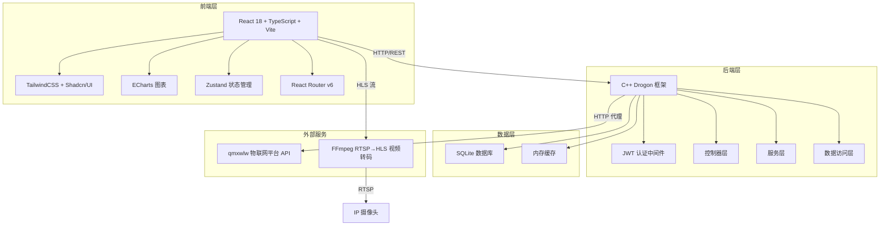
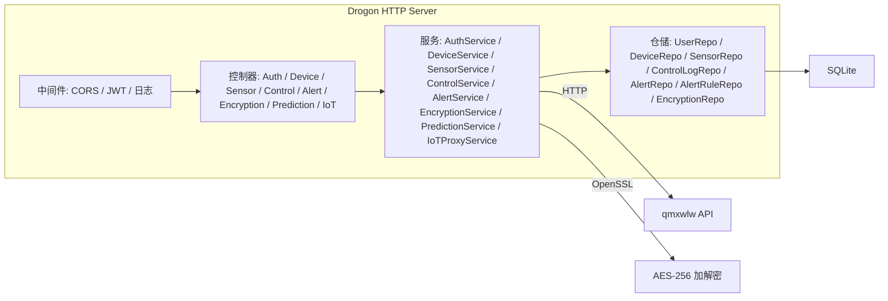
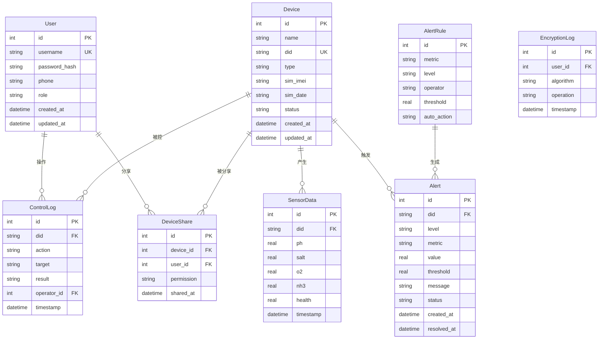

## 1. 架构设计



## 2. 技术说明

- **前端**: React 18 + TypeScript + Vite + TailwindCSS + Zustand + React Router v6
- **初始化工具**: Vite (react-ts 模板)
- **后端**: C++ Drogon 框架 (高性能异步HTTP服务器)
- **数据库**: SQLite (轻量级，适合单机部署)
- **图表**: ECharts (通过 echarts-for-react 封装)
- **图标**: Lucide React
- **视频**: HLS.js 播放 + FFmpeg RTSP转码
- **加密**: AES-256-CBC (后端实现，OpenSSL库)
- **认证**: JWT (JSON Web Token)

## 3. 路由定义

| 路由 | 用途 |
|------|------|
| /login | 登录页面 |
| /dashboard | 首页仪表盘 |
| /devices | 设备列表管理 |
| /devices/share | 设备分享管理 |
| /realtime | 实时数据监控 |
| /video | 视频监控 |
| /history | 历史数据查询 |
| /data-display | 数据展示总览 |
| /smart-control | 智能设备控制 |
| /encryption | 数据加密解密 |
| /alerts | 预警中心 |
| /prediction | 预测分析 |

## 4. API 定义

### 4.1 认证相关

```typescript
interface LoginRequest {
  username: string;
  password: string;
}

interface LoginResponse {
  token: string;
  user: {
    id: number;
    username: string;
    role: 'admin' | 'operator' | 'viewer';
  };
}

// POST /api/auth/login
// POST /api/auth/logout
// GET  /api/auth/profile
```

### 4.2 设备管理

```typescript
interface Device {
  id: number;
  name: string;
  did: string;
  type: 'sensor' | 'camera' | 'controller' | 'weather';
  sim_imei: string;
  sim_date: string;
  status: 'online' | 'offline';
  created_at: string;
  updated_at: string;
}

// GET    /api/devices?type=&status=&page=&pageSize=
// GET    /api/devices/:id
// POST   /api/devices
// PUT    /api/devices/:id
// DELETE /api/devices/:id
```

### 4.3 传感器数据

```typescript
interface SensorData {
  did: string;
  ph: number;
  salt: number;
  o2: number;
  nh3: number;
  health: number;
  timestamp: string;
}

// GET /api/sensor/realtime?did=
// GET /api/sensor/history?did=&start=&end=&metric=&page=&pageSize=
// GET /api/sensor/export?did=&start=&end=&format=csv
```

### 4.4 设备控制

```typescript
interface ControlCommand {
  did: string;
  action: 'open' | 'close';
  target: 'oxygen_pump' | 'feeder';
}

interface ControlLog {
  id: number;
  did: string;
  action: string;
  target: string;
  result: 'success' | 'failed';
  operator: string;
  timestamp: string;
}

// POST /api/control/command
// GET  /api/control/logs?did=&page=&pageSize=
// GET  /api/control/status?did=
```

### 4.5 预警系统

```typescript
interface Alert {
  id: number;
  did: string;
  level: 'I' | 'II' | 'III';
  metric: string;
  value: number;
  threshold: number;
  message: string;
  status: 'active' | 'acknowledged' | 'resolved';
  created_at: string;
  resolved_at: string | null;
}

interface AlertRule {
  id: number;
  metric: string;
  level: 'I' | 'II' | 'III';
  operator: '>' | '<' | '>=' | '<=';
  threshold: number;
  auto_action: string | null;
}

// GET    /api/alerts?status=&level=&page=&pageSize=
// PUT    /api/alerts/:id/acknowledge
// GET    /api/alerts/rules
// POST   /api/alerts/rules
// PUT    /api/alerts/rules/:id
// DELETE /api/alerts/rules/:id
```

### 4.6 数据加密

```typescript
interface EncryptRequest {
  plaintext: string;
  algorithm: 'aes-256-cbc';
}

interface DecryptRequest {
  ciphertext: string;
  iv: string;
  algorithm: 'aes-256-cbc';
}

// POST /api/encryption/encrypt
// POST /api/encryption/decrypt
// GET  /api/encryption/history?page=&pageSize=
```

### 4.7 预测分析

```typescript
interface PredictionRequest {
  did: string;
  metric: string;
  hours: number;
}

interface PredictionResponse {
  metric: string;
  predictions: Array<{
    timestamp: string;
    value: number;
    lower_bound: number;
    upper_bound: number;
  }>;
}

// GET /api/prediction?did=&metric=&hours=
```

### 4.8 物联网平台代理

```typescript
// POST /api/iot/login
// POST /api/iot/devices
// POST /api/iot/data
// POST /api/iot/op
// POST /api/iot/cmd
// POST /api/iot/history
```

## 5. 服务器架构图



## 6. 数据模型

### 6.1 数据模型定义



### 6.2 数据定义语言

```sql
CREATE TABLE users (
    id INTEGER PRIMARY KEY AUTOINCREMENT,
    username TEXT NOT NULL UNIQUE,
    password_hash TEXT NOT NULL,
    phone TEXT,
    role TEXT NOT NULL DEFAULT 'operator' CHECK(role IN ('admin', 'operator', 'viewer')),
    created_at DATETIME NOT NULL DEFAULT CURRENT_TIMESTAMP,
    updated_at DATETIME NOT NULL DEFAULT CURRENT_TIMESTAMP
);

CREATE TABLE devices (
    id INTEGER PRIMARY KEY AUTOINCREMENT,
    name TEXT NOT NULL,
    did TEXT NOT NULL UNIQUE,
    type TEXT NOT NULL CHECK(type IN ('sensor', 'camera', 'controller', 'weather')),
    sim_imei TEXT,
    sim_date TEXT,
    status TEXT NOT NULL DEFAULT 'offline' CHECK(status IN ('online', 'offline')),
    created_at DATETIME NOT NULL DEFAULT CURRENT_TIMESTAMP,
    updated_at DATETIME NOT NULL DEFAULT CURRENT_TIMESTAMP
);

CREATE TABLE sensor_data (
    id INTEGER PRIMARY KEY AUTOINCREMENT,
    did TEXT NOT NULL,
    ph REAL,
    salt REAL,
    o2 REAL,
    nh3 REAL,
    health REAL,
    timestamp DATETIME NOT NULL DEFAULT CURRENT_TIMESTAMP,
    FOREIGN KEY (did) REFERENCES devices(did)
);

CREATE INDEX idx_sensor_data_did_ts ON sensor_data(did, timestamp);

CREATE TABLE control_logs (
    id INTEGER PRIMARY KEY AUTOINCREMENT,
    did TEXT NOT NULL,
    action TEXT NOT NULL,
    target TEXT NOT NULL,
    result TEXT NOT NULL CHECK(result IN ('success', 'failed')),
    operator_id INTEGER NOT NULL,
    timestamp DATETIME NOT NULL DEFAULT CURRENT_TIMESTAMP,
    FOREIGN KEY (did) REFERENCES devices(did),
    FOREIGN KEY (operator_id) REFERENCES users(id)
);

CREATE TABLE alerts (
    id INTEGER PRIMARY KEY AUTOINCREMENT,
    did TEXT NOT NULL,
    level TEXT NOT NULL CHECK(level IN ('I', 'II', 'III')),
    metric TEXT NOT NULL,
    value REAL NOT NULL,
    threshold REAL NOT NULL,
    message TEXT,
    status TEXT NOT NULL DEFAULT 'active' CHECK(status IN ('active', 'acknowledged', 'resolved')),
    created_at DATETIME NOT NULL DEFAULT CURRENT_TIMESTAMP,
    resolved_at DATETIME,
    FOREIGN KEY (did) REFERENCES devices(did)
);

CREATE INDEX idx_alerts_status ON alerts(status);

CREATE TABLE alert_rules (
    id INTEGER PRIMARY KEY AUTOINCREMENT,
    metric TEXT NOT NULL,
    level TEXT NOT NULL CHECK(level IN ('I', 'II', 'III')),
    operator TEXT NOT NULL CHECK(operator IN ('>', '<', '>=', '<=')),
    threshold REAL NOT NULL,
    auto_action TEXT
);

CREATE TABLE device_shares (
    id INTEGER PRIMARY KEY AUTOINCREMENT,
    device_id INTEGER NOT NULL,
    user_id INTEGER NOT NULL,
    permission TEXT NOT NULL CHECK(permission IN ('view', 'view_and_control')),
    shared_at DATETIME NOT NULL DEFAULT CURRENT_TIMESTAMP,
    FOREIGN KEY (device_id) REFERENCES devices(id),
    FOREIGN KEY (user_id) REFERENCES users(id)
);

CREATE TABLE encryption_logs (
    id INTEGER PRIMARY KEY AUTOINCREMENT,
    user_id INTEGER NOT NULL,
    algorithm TEXT NOT NULL,
    operation TEXT NOT NULL CHECK(operation IN ('encrypt', 'decrypt')),
    timestamp DATETIME NOT NULL DEFAULT CURRENT_TIMESTAMP,
    FOREIGN KEY (user_id) REFERENCES users(id)
);

-- 初始管理员账户 (密码: admin123)
INSERT INTO users (username, password_hash, role) VALUES ('admin', '240be518fabd2724ddb6f04eeb1da5967448d7e831c08c8fa822809f74c720a9', 'admin');

-- 初始设备数据
INSERT INTO devices (name, did, type, sim_imei, sim_date, status) VALUES ('水质浮漂集成传感器', '861106074432561', 'sensor', '898604681524D0221278', '2026-12-01', 'online');
INSERT INTO devices (name, did, type, sim_imei, sim_date, status) VALUES ('水质联动控制箱', '864068079363984', 'controller', NULL, '2025-06-27', 'online');
INSERT INTO devices (name, did, type, sim_imei, sim_date, status) VALUES ('牧场1号摄像头', 'GK2177243', 'camera', NULL, NULL, 'online');
INSERT INTO devices (name, did, type, sim_imei, sim_date, status) VALUES ('气象监测站', 'WS001', 'weather', NULL, '2026-06-01', 'online');

-- 初始预警规则
INSERT INTO alert_rules (metric, level, operator, threshold, auto_action) VALUES ('o2', 'III', '<', 4.5, 'open_oxygen_pump');
INSERT INTO alert_rules (metric, level, 'II', '<', 3.5, 'open_oxygen_pump');
INSERT INTO alert_rules (metric, level, 'I', '<', 2.0, 'open_oxygen_pump');
INSERT INTO alert_rules (metric, level, '>', 10.0, NULL) VALUES ('nh3', 'III', '>', 5.0, NULL);
INSERT INTO alert_rules (metric, level, '>', 9.5, NULL) VALUES ('ph', 'III', '>', 9.0, NULL);
INSERT INTO alert_rules (metric, level, '<', 6.5, NULL) VALUES ('ph', 'III', '<', 6.5, NULL);
```
